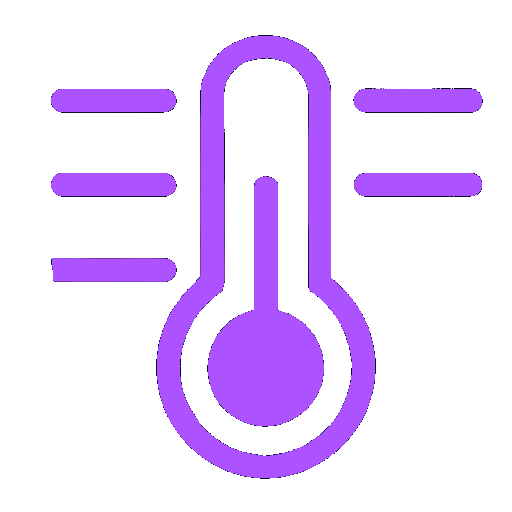

    

# Thermo STM32

This project showcases the use of an STM32 controller to read temperature using a thermistor, display the data on an LCD, and enable serial communication with a PC for user interaction.

## Summary

I explored the use of an STM32 controller, using a thermistor based temperature reading and LCD display. The project showcases:

1. Customizing the microcontroller clock frequency.
2. Serial communication with PC via RS232, using custom libraries.
3. User interface via serial port.
4. Managing and configuring the Real Time Clock.
5. Gather data from the ADC connected to an analog port.
6. Interaction with external components (button, led).
7. Analysis of problems and solutions.

The full user manual, with a critical analysis of the project, is availabe in [user_manual.pdf](user_manual.pdf) (in italian).

## Files list

- `Active Buzzer.c` contains the functions and definitions to enable, disable and control the status of the buzzer's interrupts
- `Floating_Point_unit.c` manages the FPU.
- `Gestisci_clock.c` takes care of managing the microcontroller clock, including modulating his frequency via PLL, or to enable/disable the LSI clock for the Real Time Clock.
- `Interfaccia.c` is the main user interface, as explained in the [User Manual](user_manual.pdf).
- `LCD.c` initializes, manages and enable writing to the the LCD display.
- `LED.c` manages the LED, including blinking function.
- `Pulsante.c` takes care of handling the user input via external button.
- `Real_Time_Clock.c` manages the RTC, for setting up and reading the current date and time.
- `Seriale.c` enables and returns the state of the serial port RS232, allowing modification of the Baud-Rate and I/O via serial port.
- `Termistore.c` manages and reads the temperature via the external thermistor attached to the ADC. Uses a single-pole IIR low-pass filter for noise reduction.
- `Ulitily.c` many utilities since the use of external libraries was not allowed, e.g.: conversion from int to char, cleaning and concatenating strings, conversion from hex to long, mathematical functions, etc.
